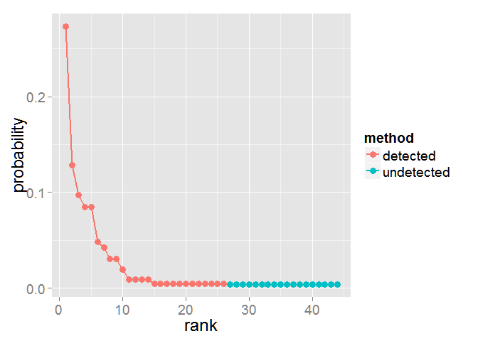
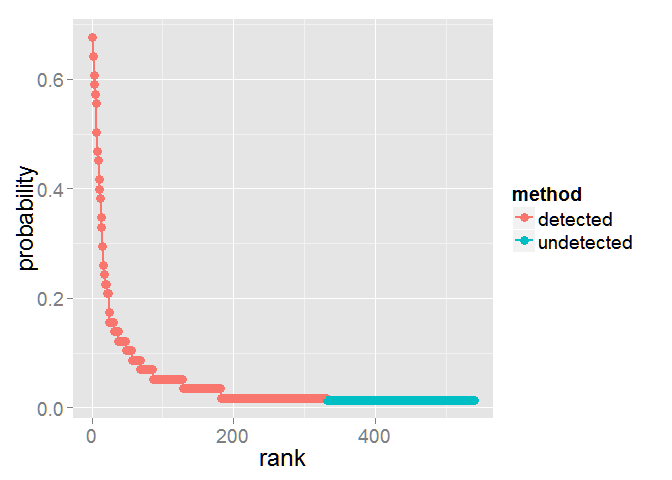

Jade (R package)
================

<h4>
Most recent update time: June 16, 2015
</h4>
<h4>
by T. C. Hsieh, and Anne Chao
</h4>
<h4>
Institute of Statistics, National Tsing Hua University, Hsin-Chu, Taiwan
30043
</h4>
The program Jade is a R source code to compute the Joint species-rank
Abundance Distribution/Estimation present by Chao et al. (2015). This
program provieds species rank distribution (RAD) by separately adjusting
the sample relative abundances for the set of species detected in the
sample and estimating the relative abundances for the set of species
undetected in the sample but inferred to be present in the assemblage.

### Software needed to run the development version

-   Required: [R](http://cran.rstudio.com/)
-   Suggested: [RStudio IDE](http://www.rstudio.com/ide/download/)

### How to run: start R(studio) and copy-and-paste the following commands:

Start R(studio) and copy-and-paste the commands below:

    # install packages, you can skip this commands if you had installed them
    install.packages(c("devtools","ggplot2"))
    library(devtools)
    install_github('JohnsonHsieh/Jade')
    library(Jade)

Run a simple example:

-   Abundance-based example

<!-- -->

    data(ExAbun)
    RAD_Abun <- SpecDist(ExAbun, "abundance")
    ggplot(RAD_Abun, aes(x=rank, y=probability, colour=method)) + 
      geom_point(size=3) + geom_line(size=1) + theme(text=element_text(size=18))

-   Incidence-based example

<!-- -->

    data(ExInci)
    RAD_Inci <- SpecDist(ExInci, "incidence")
    ggplot(RAD_Inci, aes(x=rank, y=probability, colour=method)) + 
      geom_point(size=3) + geom_line(size=1) + theme(text=element_text(size=18))

